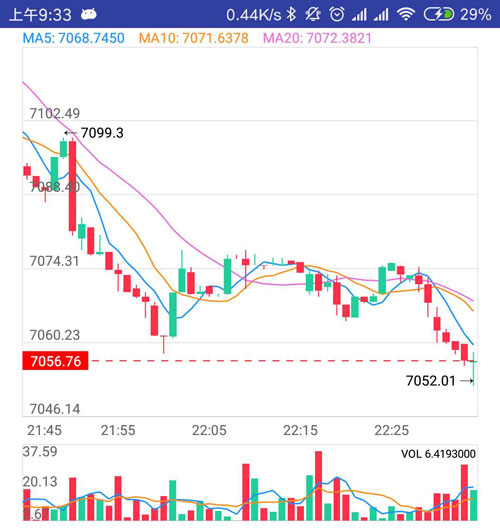
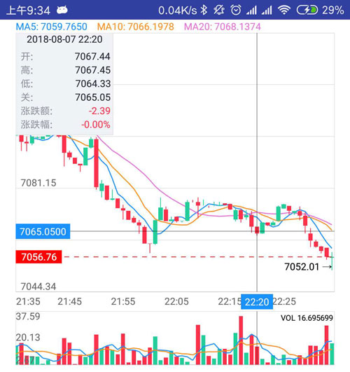

# LaplaceKLine
lilifeng@laplacetech.cn
拉普拉斯K线图表
[](https://jitpack.io/#limxing/LaplaceKLine)

Powered By [MPAndroidChart](https://github.com/PhilJay/MPAndroidChart)

 &nbsp;

## Usage
#### Gradle

Project level build.gradle
```
allprojects {
    repositories {
        maven { url 'https://jitpack.io' }
    }
}
```
App level build.gradle
```
dependencies {
    implementation 'com.github.limxing:LaplaceKLine:1.1.4"'
}
```

#### License
LaplaceKLine is available under the MIT license.